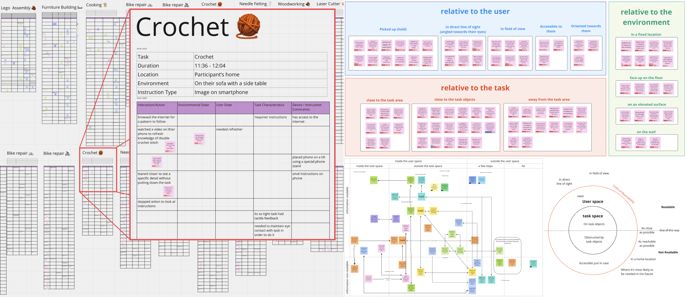
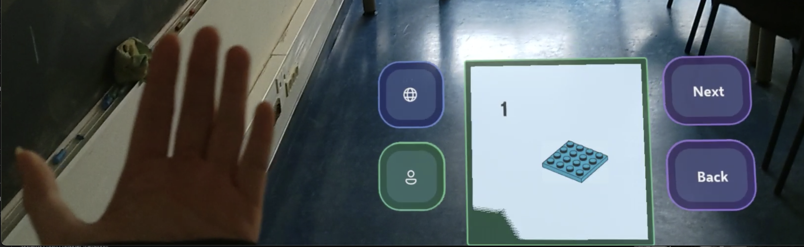

## Context

I have always been fascinated by AR/VR and spatial interfaces. For my undergraduate thesis, I built a [VR platform for therapy](vr-therapy), and for my master's thesis I explored the impact of AR facial filters on self-esteem. Working in product design, the design space for 2D UIs seemed heavily saturated, with limited opportunities for innvotion. Meanwhile, design conventions for 3D spatial interfaces were still emerging and seemed ripe for innovation and experimentation. 

When I landed the opportunity to do fully-funded research at a lab in France, collaborating with surgeons to study how AR interfaces could enhance surgical workflows, it was too good to pass up. I packed up my bags for Sorbonne Université in Paris, and embarked on a <i>lil' research adventure.</i>

## Problem & Approach

When both hands are occupied by a task, it is difficult to interact with information systems that provide important assistive information. This is a problem faced by surgeons, mechanics and chefs alike. While handsfree interaction techniques address the physical constraints, the mental interaction cost remains. Users continue to have to think about when they might next need the system. 

### Approach

<b> Context Adaptive Interfaces </b> reduce the need for system interation by anticipating users' needs. However, many context-adaptive systems are domain-specific catering to a specific environment or use case. This made them difficult to scale, and designing them would require deep subject matter expertise. 

I wanted to identify characteristics shared between tasks that affect content placement. Then use these characteristics to inform the design of a <b>domain-agnostic, context-adaptive</b> mixed reality system for displaying assistive information. To do this, I started by planning an observation study to learn more about how people actually used assistive information. In parallel, I was building an AR system would then adapt information position based on the characteristics I identified in this study.  

## The Research

This research was accepted for publication, you can read the full paper [here](https://dl.acm.org/doi/10.1145/3765712.3765733). I've written up a "less academic" overview here. 

I recruited participants from local businesses (bike shops, electronics) and university societies for crafting, woodworking, chemistry etc, in search of people who did bimanual tasks where they also needed to refer to information. 

I observed them while they did their task, and interviewed them afterward to explore the explicit reasons behind certain behaviours I'd observed. 

Photos of my participants doing a variety of bimanual tasks. Unfortunately, images from surgery can't be displayed.

## Data Analysis 

Interviews were transcribed and observation grids were coded bottom up before being augmented with insights from the corresponding interview transcripts. 

The observation grids and the a snapshot of the miro board I used to group codes and develop the frameworks to describe the data

Codes were then grouped by direct similarity, then conceptual relevance. I developed several high-level frameworks to describe the data: 
- readability vs reachability 
- type of movement used (eye, head, hand, body)
- relative to user, task or environment 

Finally, I settled on grouping codes based on the <b>reference frame</b> they used. 

  
  
The 3 reference frames as described by <a href="https://dl.acm.org/doi/10.1016/j.ijhcs.2011.02.005">Cockburn et al.</a> used to describe the position of assistive information in our observations

## Results 

### Overview 
<b>Reseach Question:</b> How do people position assistive information during physical tasks? 

<b>Main Findings:</b>
1. Participants change the position of assistive information throughouttheir task
2. Participants adapt position in response to changing task characteristics

### Task Characteristics 
We identified 2 task characteristics that influenced the position of assistive information 
1. <b>Frequency of Information Access</b>
    - Frequent 
    - Infrequent
2. <b>Type of Mobility </b>
    - Predictable
    - Unpredictable 

For each characteristic we had the following findings 

<b>Frequency of Information Access</b>
- Information needed frequently is positioned at a lower access cost 
- Information needed occasionally highlighted the trade-off between <b>access cost</b> and <b>clutter</b>

<b>Type of Mobility </b>
- When task locations were <b>predictable</b>, Relative-to-World positioning was preferred 
- When task locations were <b>unpredictable</b>, Relative-to-Body positioning was preferred 
- When task locations were <b>multiple</b> or <b>unpredictable</b>, Relative-to-Object positioning was preferred 

## So what? 

<b>There is unlikely to be one best position for assistive information throughout the task. As such, positioning adaptive to task characteristics could be valuable. </b>

### Recommendations 
1. Systems should consider transitioning the position of information across different reference frames. 

  
  
<a href="https://dl.acm.org/doi/10.1145/3613904.3642220">Pei et al.'s</a> survey of 113 commercial applications with 3D UIs showed that only 6.2 % allowed users to transition UIs between RFs.

2. Systems should consider content-duplication in lieu of optimising for smooth transitions 

  
    
Many systems focus on trying to make the information follow the user as smoothly as possible, but simply duplicating content in certain "useful" places also has its strengths

3. Systems should better accomodate for predictable motion and users' spatial memory. 

  
  
Existing work mostly explores adapting to unpredictable movement. We saw participants home information in fixed locations while they moved around. They also left information in the places they needed them most.

4. Systems should consider the type of information need the user has when choosing between reducing access cost and reducing clutter, i.e. detailed comparison might warrant more proximity than clarification. 

  
  
<a href="https://doi.org/10.1186/s41235-025-00650-5">Warden et al.</a> showed that when using head-mounted displays in safety-critical environments, increasing clutter caused increasing cost to both speed and accuracy.

5. Future work should investgiate factors affecting positioning method choice for assistive information displayed with ARHMDs. 

(Snapshot from the Hololens assistance system I was building) The cost of using Relative-to-Body and Relative-to-Object positioning in the real world is high. ARHMDs remove the barriers to entry for positioning content in all reference frames. Future work could validate ths findings of this work in AR, and further explore the effect of these task characteristics when all refereance frames are equally easy to access 
