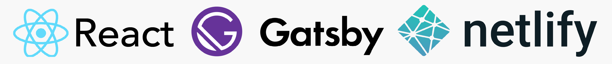

import BeforeAfterSlider from '../../../components/BeforeAfterSlider.jsx'
import codeImage from './code-andi-2.png'
import artImage from './art-andi-2.png'

## The Motivation

When I was looking for graduate jobs in 2017, as a computer science student looking to break into UX design, an online portfolio was crucial. That summer, I built my first Wordpress site and wrote my first case studies for the projects I'd done over the last few years. At the time, I would have loved to have built a website from scratch, but with little javascript experience I chose Wordpress to economise on development time and focus on writing the content.

Fast forward to 2019. After working as a UX Engineer for over a year, applying to graduate school once more required an online portfolio. This time, I leapt at the opportunity to put my newfound javascript skills to good use.

Edit (Feb 2026): I have since built another portfolio website (this one), so I have redeployed the version we discuss here at a different [URL](https://andikoh.com)

## Choosing the Right Tools

The most straightforward way I knew to start building a website was to write HTML, CSS and Javascript files, buy a hosting package and domain name, then host the files on that server and point the domain name at it. Even using Wordpress, my first website had required navigating the complex world of cPanel and Namecheap.com's awful interface to make my site go live.

However, since 2017, static site generators had come to my attention. They were more complicated to use than a Content Management System (CMS) like Wordpress or Squarespace, but provided a level of customisation that I liked. For the purpose of a portfolio website, a static site was more than sufficient as there was unlikely to be heavy user database interaction.

For hosting, rather than pay \$40 for a hosting package off Namecheap.com, there were now options like Github Pages, Heroku and Netlify that offered free packages. These were especially convenient as I wanted to put my code up on Github, so anything that could just pull the files off Github would be ideal.

After this initial discovery stage, I had two key decisions to make:

<ol>
    <li>
        Which static site generator to use
    </li>
    <li>
        Which hosting service to use
    </li>
</ol>

For static site generators, I investigated Hugo, Gatsby, Jekyll and Drupal. Ultimately, the deciding factor my preference for using React, which I already familiar with from work. Gatsby was the only framework written in React and it had easy integrations with a wide range of hosting optins, including Netlify and Heroku. Hugo was a close contender, as it had similar integrations and was written in Go, which I was interested in learning. However, I decided to pick my battles and focus on the learning curve of building the website rather than tackling a new language.

For hosting, Heroku was less suited to hosting static website and had a far less generous free tier. Gatsby had Netlify integration built-in and deploying a site was a simple matter of linking Netlify to my Gatsby code on Github and few more clicks. The Gatsby Netlify pairing was also well documented by both services and the internet in general.

## The Setup

It took just over a day of work to host the default Gatsby template on Netlify, but there were some teething problems connecting my own domain name as it needed to be moved over from Namecheap's server. It was interesting to watch the new nameservers being propogated through the internet - a process that took a few hours. Once this was done, I had a live site deployed that would auto-build when changes to master branch of the linked Github repository were detected.

#### GraphQL

One of the main features of Gatsby was its use of GraphQL. It was a query language, like SQL. It was how data, like the images on a page, were queried and served to the components. I had never used it before, but the examples in the template were a useful start.

It was an incredibly powerful way to programmatically generate pages. All the pages on the site are written as Markdown files which are then served to shared page template. This ensured consistency and meant I didn't have to write a whole new React component for each project.

It also allowed me to filter the Markdown pages for files marked as a "Case Study" and display them on a separate Case Studies page quickly and without any code duplication.

Of course, this convenience did come at the cost of customisation and I often found myself working around the template to make a simple feature that was only needed on a single page. Overall however, I felt it was a valid compromise.

## The Design

A portfolio website is all about the image you want to project. It represents a showcase of your work and your personal style, available for all to see. As I was building this website, it was very difficult not to be incredibly self-conscious and question every design decision I made.

I knew I wanted a minimalist, image-centric design with clean lines and bold colours. As a visual designer, I wanted the pictures of my work to catch the eye, but as a UX designer I knew I had to put in good case studies to back up the pretty pictures.

The visual design of the website is purely personal preference. I experimented with colour themes and fonts until I found a combination I liked. It was difficult to resist the urge to add more colours and use exotic fonts, but with the guidance the designer at work, I was able to resist the common pitfalls of amateur web design. The software engineer in me pushed very hard for a dark theme, but I ultimately settled on a monochrome light style because it felt cleaner and more optimistic.

#### Home Page and Case Studies Page

The main lesson I learned from my previous portfolio website was to make it as easy as possible for people to find what they wanted, regardless of what they were looking for. My potential viewership included recruiters, potential employers and graduate school admissions officers all looking to evaluate me based on different criteria.

The aim of the Home page was to display all my projects in a way that would help people gain a sense of my skills and interests, from web development and UX design to digital art and photography. I then made a separate Case Studies page to make it easier for people to filter out my personal art projects and focus more on the detailed write ups of projects.

#### Content Pages

Case studies were often quite long, in particular mine often included design and technical implementation details. To help viewers evaluate their interest in the case study, I started with overview sections like My Role and The Motivation before delving into more detail. Even with this, I felt it would be useful for users to be able to click through to relevant sections, rather than skim and scroll through to find the parts they were interested in.

To achieve this, I used page anchors and provided a Contents section at a point in the case study where I felt it would be useful to provide users insight into what content followed. I deliberately chose not to put the Contents section at the top of every page because I felt it would discourage viewers from reading the contextual information provided about each project. Instead, after initial descriptions of the project, users are able to use the Contents section to navigate to sections that provide detail on areas of the project they might be more interested in i.e. design process or implementation details.

## Building the Slider

My original Wordpress website had a Before After Slider as its landing page and I remember spending hours on the artwork for it. I wanted to port this feature to my new site, but this time I couldn't use a Wordpress plugin.

I built my own Before After Slider from scratch in React, querying the images using GraphQL, then manually positioning the images with CSS. The animation of the image widths was done using the React Motion library, an easy way to add customisable spring animations to React components.

<BeforeAfterSlider
  client:visible
  leftImage={codeImage.src}
  rightImage={artImage.src}
  leftAlt="Code version"
  rightAlt="Art version"
/>

 Need I mention that I'm visually creative <i>and</i> I can code? It seems like back in the day, I felt the need to express this aggressively.

