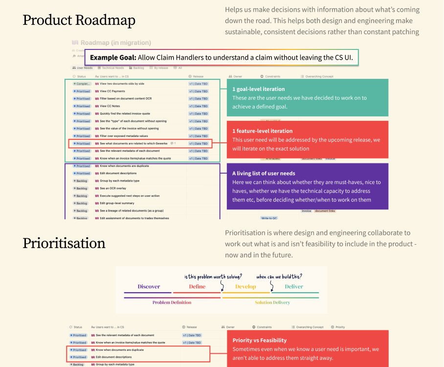
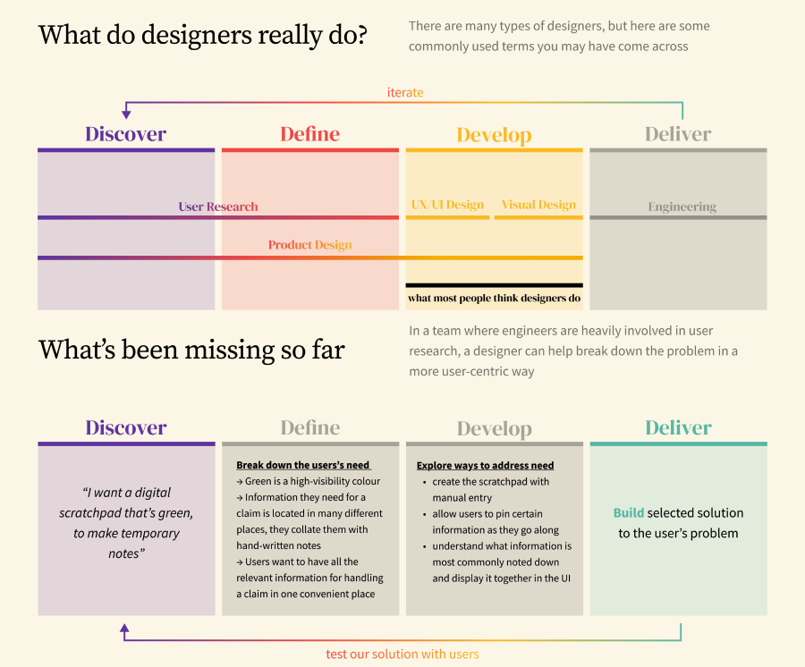
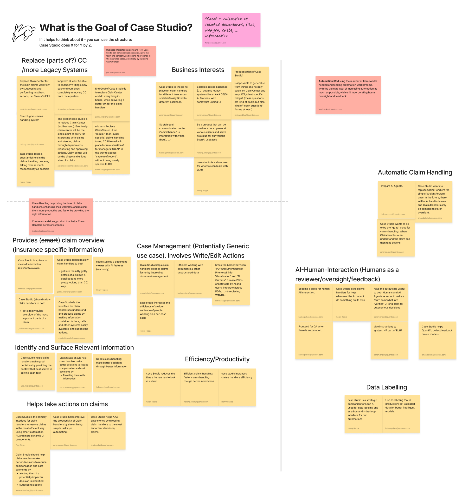
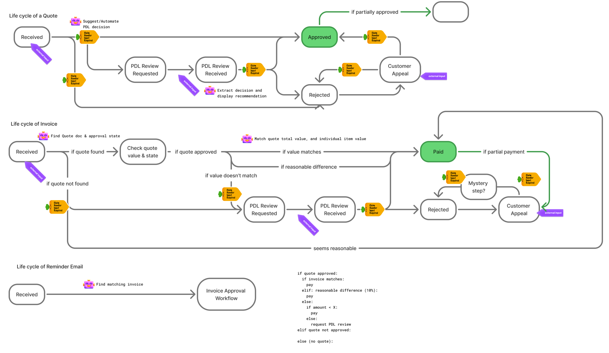
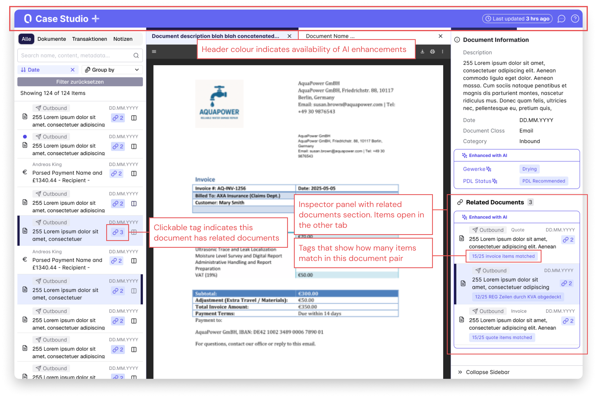

## Framing the challenge

I led the design of the QuantCo Platform from 0 → 1, working closely with engineering leads, AI researchers, and product leadership to transform a fragmented toolset into a coherent product surface. The design challenge was less interface design, more strategic reframing of how our technology was positioned and delivered.

At the time, the tooling landscape was fractured: internal prototypes stitched together by scripts, powerful tools siloed into specific teams or clients, and every project rebuilding the same scaffolding from scratch instead of assembling it from existing work. The product didn't exist yet. But the ambition was clear, to create a modular, extensible platform that made the entire AI-native claims processing workflow observable, governable and composable.

<figure>
<!-- One box around the whole thing: the four layers are the platform, so they
     sit inside a single container rather than reading as four loose cards. The
     relative wrapper inside it is what the connector overlays measure
     themselves against, so it has to be the box's content area - same width as
     the layer cards, nothing between them. -->

<!-- Every layer is the same two-column row: what it is on the left, what it
     contains on the right. The connecting lines are a single overlay over the
     whole thing, added after the layers below. Under lg the rows stack, text
     over visual, and the lines are dropped. -->

<!-- Layer 1: the two experiences that sit on top of everything else. The one
     layer that isn't a two-column row - it's the whole platform, so the title
     runs across the top and the two surfaces sit side by side underneath. -->

<h3 class="font-heading text-[#19224D] text-2xl sm:text-3xl leading-tight">Unified claims platform</h3>

A platform for managing claims from first notice of loss to payout, built with agentic claims processing in mind.

<h4 class="font-heading text-[#19224D] text-lg leading-snug">Claimant experience</h4>

Digital, multi-channel intake to collect structured data about claims.

Automated follow-ups

Inbound voice agents

Upfront quality checks

Self-service updates

<h4 class="font-heading text-[#19224D] text-lg leading-snug">Claim handler experience</h4>

A human-in-the-loop workspace to process claims in collaboration with our agents.

Call assistant

Document workspace

Suggested actions

Observability &amp; audit

<!-- Layer 2: the agents both surfaces above draw on. Nothing joins them to
     each other - they are self-contained units, and the box around them is
     the whole point: a set to pick from, not a pipeline to run end to end. -->

<h3 class="font-heading text-[#19224D] text-2xl sm:text-3xl leading-tight">Claims agents</h3>

Reusable decision units. Each one stands alone, and a claim draws on whichever it needs.

<svg viewBox="0 0 24 24" fill="none" stroke="currentColor" stroke-width="1.6" stroke-linecap="round" stroke-linejoin="round"><path d="M3 12h5" /><path d="M8 12l5-5h6" /><path d="M8 12l5 5h6" /><path d="M17 4l3 3-3 3" /><path d="M17 14l3 3-3 3" /></svg>

Triage

<svg viewBox="0 0 24 24" fill="none" stroke="currentColor" stroke-width="1.6" stroke-linecap="round" stroke-linejoin="round"><path d="M12 3l7 3v6c0 4-3 7.2-7 9-4-1.8-7-5-7-9V6l7-3z" /><path d="M9 12l2.2 2.2L15.5 10" /></svg>

Coverage

<svg viewBox="0 0 24 24" fill="none" stroke="currentColor" stroke-width="1.6" stroke-linecap="round" stroke-linejoin="round"><path d="M20 12a8 8 0 10-3 6.2" /><path d="M20 5v4h-4" /></svg>

Recourse

<svg viewBox="0 0 24 24" fill="none" stroke="currentColor" stroke-width="1.6" stroke-linecap="round" stroke-linejoin="round"><path d="M4 5h16v11H9l-5 4V5z" /><path d="M10.4 8.6a1.9 1.9 0 013.3 1.3c0 1.3-1.7 1.5-1.7 2.7" /><path d="M12 15.2h.01" /></svg>

Question engine

<svg viewBox="0 0 24 24" fill="none" stroke="currentColor" stroke-width="1.6" stroke-linecap="round" stroke-linejoin="round"><path d="M6 3h8l4 4v14H6V3z" /><path d="M14 3v4h4" /><path d="M9 11h6" /><path d="M9 14.5h4" /><path d="M9.2 18l1.6 1.6L14 16.4" /></svg>

Invoice checks

<!-- Layer 3: the shared data the agents read from -->

<h3 class="font-heading text-[#19224D] text-2xl sm:text-3xl leading-tight">Data unification</h3>

One centralised place for everything needed to power the agents.

Claim data

Calls, photos, documents, policy

Agent knowledge

Rules, procedures, exceptions

<!-- Layer 4: the systems we don't own, at the bottom -->

<h3 class="font-heading text-[#19224D] text-2xl sm:text-3xl leading-tight">Platform integrations</h3>

Connects to existing systems and data sources.

Core claims system

Document stores

Company wikis

<!-- The connectors. One overlay for the whole figure, sitting on top of the
     layer cards rather than in the gaps between them, so a line can start at
     an object inside one card and finish at an object inside another. It
     repeats the cards' own grid - two columns, same gap, same horizontal
     padding - with an empty first cell, which is what makes the browser hand
     us the exact x extent of the column the objects live in.

     Every line stops short of whatever it meets, so nothing touches a box. -->

<svg class="qc-flow-over" viewBox="0 0 100 100" preserveAspectRatio="none" fill="none" stroke="#19224D" stroke-width="1">
<!-- Integrations: the three named systems, each rising out of its own item -->
<g stroke-opacity="0.34">
<path d="M15.92 88.77Q15.92 86.37 50 84.41" vector-effect="non-scaling-stroke" />
<path d="M50 88.77V84.41" vector-effect="non-scaling-stroke" />
<path d="M84.08 88.77Q84.08 86.37 50 84.41" vector-effect="non-scaling-stroke" />
</g>
<!-- And the ones not worth naming: whatever else a given client happens to
     run. Same curves into the same point, but with nothing underneath them
     and left much fainter, so they read as "and the rest". -->
<g stroke-opacity="0.15">
<path d="M6 88.3Q6 86.16 50 84.41" vector-effect="non-scaling-stroke" />
<path d="M28 86.78Q28 85.48 50 84.41" vector-effect="non-scaling-stroke" />
<path d="M40 87.83Q40 85.95 50 84.41" vector-effect="non-scaling-stroke" />
<path d="M60 87.13Q60 85.63 50 84.41" vector-effect="non-scaling-stroke" />
<path d="M72 88.07Q72 86.06 50 84.41" vector-effect="non-scaling-stroke" />
<path d="M94 87.48Q94 85.79 50 84.41" vector-effect="non-scaling-stroke" />
</g>
<!-- Out of the first meeting point, as the two things the agents read -->
<g stroke-opacity="0.34">
<path d="M50 84.41Q24.44 82.01 24.44 80.05" vector-effect="non-scaling-stroke" />
<path d="M50 84.41Q75.56 82.01 75.56 80.05" vector-effect="non-scaling-stroke" />
</g>
<!-- Those two back out again, meeting a second time and entering the agents
     as the one thing they all draw on -->
<g stroke-opacity="0.34">
<path d="M24.44 70.25Q24.44 67.96 50 66.09" vector-effect="non-scaling-stroke" />
<path d="M75.56 70.25Q75.56 67.96 50 66.09" vector-effect="non-scaling-stroke" />
<path d="M50 66.09V61.94" vector-effect="non-scaling-stroke" />
</g>
</svg>
<!-- The travelling dots: the same lines a second time as motion paths, after the
     svg so a dot rides on top of the line it follows. Only the three named
     sources carry one - the flow starts as three dots, not nine, so the faint
     "and the rest" curves are left out of the journey. -->

<!-- The top layer is a full-width card, so its one join gets a second overlay
     in that card's own x space: no columns, just the same horizontal padding. -->

<svg class="qc-flow-over" viewBox="0 0 100 100" preserveAspectRatio="none" fill="none" stroke="#19224D" stroke-width="1">
<!-- Out of the agents, over to the middle, then split between the two
     experiences that run on them -->
<g stroke-opacity="0.34">
<path d="M76.08 47.66C76.08 45.78 50 45.78 50 43.91" vector-effect="non-scaling-stroke" />
<path d="M50 43.91Q24.46 41.85 24.46 40.16" vector-effect="non-scaling-stroke" />
<path d="M50 43.91Q75.54 41.85 75.54 40.16" vector-effect="non-scaling-stroke" />
</g>
</svg>

<figcaption>The platform in layers: the systems we integrate with feed one unified data layer, that data powers a composable set of claims agents, and the agents power the two experiences on top</figcaption>
</figure>

---

## Navigating ambiguity, not just complexity

The platform had to bring together the work of many teams, each building tools for a different area of the claims lifecycle, while the agentic technology underneath them was still being developed. What an agent could reliably do shifted month to month, and nobody had a settled answer for how that capability should appear to a claim handler. An agent that reads, drafts or decides needs a defined place for a person to step in, and in insurance that place isn't a preference: decisions have to be explainable, auditable and attributable to someone. Every agent touchpoint was a product question and a regulatory one at once.

Instead of designing screens for an ever-shifting capability set, I developed a framework for categorising different levels of agentic automation and defined custom interaction patterns for all levels of human-in-the-loop that needed to be supported. Next, I designed the frame our tools would arrive into: a modular structure where each tool could feel native to its own users while sitting inside one navigation system, one design language and familiar interaction patterns. Teams could build into the platform without inventing their own patterns, and a claim handler moving between tools didn't have to learn a new product each time. It let the platform scale both within existing customers and to new clients adopting our capabilities for the first time.

<figure>
<!-- The automation framework: how much autonomy a step of a claim can carry, as a
     function of what it costs to get wrong (stakes) and how hard it is to do
     (complexity). Markup rather than an image so it stays legible at any width
     and uses the page's own type. The axes are a hairline plus a chevron
     positioned on its end, the same trick the platform diagram uses; both are
     dropped below sm, where the quadrants stack and their own titles carry the
     high/low reading on their own. -->

<!-- Stakes runs up the side, so its label runs up the side too -->

Stakes

<svg class="absolute left-1/2 -translate-x-1/2 -top-[4px] w-[9px] h-[7px]" viewBox="0 0 9 7" fill="none" stroke="#19224D" stroke-opacity="0.45" stroke-width="1.4" stroke-linecap="round" stroke-linejoin="round"><path d="M1 6L4.5 1 8 6" /></svg>

<h4 class="font-heading text-[#1B7FD4] text-lg sm:text-xl leading-snug">High-stakes, low-complexity claims</h4>

Supervised automation

<svg class="w-4 h-4 shrink-0 mt-[1px] text-[#1B7FD4]" viewBox="0 0 24 24" fill="none" stroke="currentColor" stroke-width="1.7" stroke-linecap="round" stroke-linejoin="round" aria-hidden="true"><path d="M4 15s1-1 4-1 5 2 8 2 4-1 4-1V3s-1 1-4 1-5-2-8-2-4 1-4 1z" /><path d="M4 22v-7" /></svg>

AI capable, but not allowed

<svg class="w-4 h-4 shrink-0 mt-[1px] text-[#1B7FD4]" viewBox="0 0 24 24" fill="none" stroke="currentColor" stroke-width="1.7" stroke-linecap="round" stroke-linejoin="round" aria-hidden="true"><path d="m11 17 2 2a1 1 0 1 0 3-3" /><path d="m14 14 2.5 2.5a1 1 0 1 0 3-3l-3.88-3.88a3 3 0 0 0-4.24 0l-.88.88a1 1 0 1 1-3-3l2.81-2.81a5.79 5.79 0 0 1 7.06-.87l.47.28a2 2 0 0 0 1.42.25L21 4" /><path d="m21 3 1 11h-2" /><path d="M3 3 2 14l6.5 6.5a1 1 0 1 0 3-3" /><path d="M3 4h8" /></svg>

AI-led, human-supported

<svg class="w-4 h-4 shrink-0 mt-[1px] text-[#1B7FD4]" viewBox="0 0 24 24" fill="none" stroke="currentColor" stroke-width="1.7" stroke-linecap="round" stroke-linejoin="round" aria-hidden="true"><path d="m14.5 12.5-8 8a2.119 2.119 0 1 1-3-3l8-8" /><path d="m16 16 6-6" /><path d="m8 8 6-6" /><path d="m9 7 8 8" /><path d="m21 11-8-8" /></svg>

AI suggests action, human approves

<h4 class="font-heading text-[#DF4B32] text-lg sm:text-xl leading-snug">High-stakes, high-complexity claims</h4>

Supported manual

<svg class="w-4 h-4 shrink-0 mt-[1px] text-[#DF4B32]" viewBox="0 0 24 24" fill="none" stroke="currentColor" stroke-width="1.7" stroke-linecap="round" stroke-linejoin="round" aria-hidden="true"><path d="M4 15s1-1 4-1 5 2 8 2 4-1 4-1V3s-1 1-4 1-5-2-8-2-4 1-4 1z" /><path d="M4 22v-7" /></svg>

AI not fully capable

<svg class="w-4 h-4 shrink-0 mt-[1px] text-[#DF4B32]" viewBox="0 0 24 24" fill="none" stroke="currentColor" stroke-width="1.7" stroke-linecap="round" stroke-linejoin="round" aria-hidden="true"><path d="m11 17 2 2a1 1 0 1 0 3-3" /><path d="m14 14 2.5 2.5a1 1 0 1 0 3-3l-3.88-3.88a3 3 0 0 0-4.24 0l-.88.88a1 1 0 1 1-3-3l2.81-2.81a5.79 5.79 0 0 1 7.06-.87l.47.28a2 2 0 0 0 1.42.25L21 4" /><path d="m21 3 1 11h-2" /><path d="M3 3 2 14l6.5 6.5a1 1 0 1 0 3-3" /><path d="M3 4h8" /></svg>

Human-led, AI-supported

<svg class="w-4 h-4 shrink-0 mt-[1px] text-[#DF4B32]" viewBox="0 0 24 24" fill="none" stroke="currentColor" stroke-width="1.7" stroke-linecap="round" stroke-linejoin="round" aria-hidden="true"><path d="m14.5 12.5-8 8a2.119 2.119 0 1 1-3-3l8-8" /><path d="m16 16 6-6" /><path d="m8 8 6-6" /><path d="m9 7 8 8" /><path d="m21 11-8-8" /></svg>

AI does what it can, hands off to human

<h4 class="font-heading text-[#1E8449] text-lg sm:text-xl leading-snug">Low-stakes, low-complexity claims</h4>

Full automation

<svg class="w-4 h-4 shrink-0 mt-[1px] text-[#1E8449]" viewBox="0 0 24 24" fill="none" stroke="currentColor" stroke-width="1.7" stroke-linecap="round" stroke-linejoin="round" aria-hidden="true"><path d="M4 15s1-1 4-1 5 2 8 2 4-1 4-1V3s-1 1-4 1-5-2-8-2-4 1-4 1z" /><path d="M4 22v-7" /></svg>

AI capable and allowed

<svg class="w-4 h-4 shrink-0 mt-[1px] text-[#1E8449]" viewBox="0 0 24 24" fill="none" stroke="currentColor" stroke-width="1.7" stroke-linecap="round" stroke-linejoin="round" aria-hidden="true"><path d="m11 17 2 2a1 1 0 1 0 3-3" /><path d="m14 14 2.5 2.5a1 1 0 1 0 3-3l-3.88-3.88a3 3 0 0 0-4.24 0l-.88.88a1 1 0 1 1-3-3l2.81-2.81a5.79 5.79 0 0 1 7.06-.87l.47.28a2 2 0 0 0 1.42.25L21 4" /><path d="m21 3 1 11h-2" /><path d="M3 3 2 14l6.5 6.5a1 1 0 1 0 3-3" /><path d="M3 4h8" /></svg>

AI-run

<svg class="w-4 h-4 shrink-0 mt-[1px] text-[#1E8449]" viewBox="0 0 24 24" fill="none" stroke="currentColor" stroke-width="1.7" stroke-linecap="round" stroke-linejoin="round" aria-hidden="true"><path d="m14.5 12.5-8 8a2.119 2.119 0 1 1-3-3l8-8" /><path d="m16 16 6-6" /><path d="m8 8 6-6" /><path d="m9 7 8 8" /><path d="m21 11-8-8" /></svg>

AI executes

Not a target state

Compliance, legal, and regulatory requirements demand human oversight.

<h4 class="font-heading text-[#A9760B] text-lg sm:text-xl leading-snug">Low-stakes, high-complexity claims</h4>

Audited automation

<svg class="w-4 h-4 shrink-0 mt-[1px] text-[#A9760B]" viewBox="0 0 24 24" fill="none" stroke="currentColor" stroke-width="1.7" stroke-linecap="round" stroke-linejoin="round" aria-hidden="true"><path d="M4 15s1-1 4-1 5 2 8 2 4-1 4-1V3s-1 1-4 1-5-2-8-2-4 1-4 1z" /><path d="M4 22v-7" /></svg>

AI imperfect, but allowed

<svg class="w-4 h-4 shrink-0 mt-[1px] text-[#A9760B]" viewBox="0 0 24 24" fill="none" stroke="currentColor" stroke-width="1.7" stroke-linecap="round" stroke-linejoin="round" aria-hidden="true"><path d="m11 17 2 2a1 1 0 1 0 3-3" /><path d="m14 14 2.5 2.5a1 1 0 1 0 3-3l-3.88-3.88a3 3 0 0 0-4.24 0l-.88.88a1 1 0 1 1-3-3l2.81-2.81a5.79 5.79 0 0 1 7.06-.87l.47.28a2 2 0 0 0 1.42.25L21 4" /><path d="m21 3 1 11h-2" /><path d="M3 3 2 14l6.5 6.5a1 1 0 1 0 3-3" /><path d="M3 4h8" /></svg>

AI-run, human-audited

<svg class="w-4 h-4 shrink-0 mt-[1px] text-[#A9760B]" viewBox="0 0 24 24" fill="none" stroke="currentColor" stroke-width="1.7" stroke-linecap="round" stroke-linejoin="round" aria-hidden="true"><path d="m14.5 12.5-8 8a2.119 2.119 0 1 1-3-3l8-8" /><path d="m16 16 6-6" /><path d="m8 8 6-6" /><path d="m9 7 8 8" /><path d="m21 11-8-8" /></svg>

AI executes, human spot checks

<svg class="absolute top-1/2 -translate-y-1/2 -right-[4px] w-[7px] h-[9px]" viewBox="0 0 7 9" fill="none" stroke="#19224D" stroke-opacity="0.45" stroke-width="1.4" stroke-linecap="round" stroke-linejoin="round"><path d="M1 1L6 4.5 1 8" /></svg>

Complexity

<figcaption>The automation framework: what a claim costs to get wrong, against how hard it is to handle, gives four levels of agentic automation — each with its own human-in-the-loop interaction pattern</figcaption>
</figure>

---

## From client delivery to a product mindset

The landscape I arrived into at QuantCo was heavily driven by client-specific engineering. Forward-deployed teams of data scientists and ML engineers embedded inside insurers, building what each client needed, then moving on. In practice however, these engagements often became long-running, with no clear handover point. Ultimately, the shift into becoming more product driven came from the need to deliver outcomes at scale in a more sustainable, less labour-intensive format. Early on, I embedded with forward-deployed teams at the client and put product framing into engineering decisions early enough to shape what was built. For every capability we scoped, I asked the same question: which parts of this belong to this client, and which belong to the product?

Then came the advocacy piece: these teams had never worked with a designer, nor on a centralised product effort. To break out of the tunnel vision of client delivery I ran vision workshops to define what a QuantCo platform could look like, hosted outreach sessions on product and design thinking, and introduced a roadmap and prioritisation framework to hold client commitments and product bets in the same view. Within 12 months of joining, the role of design had shifted from helping teams deliver better tools, to shaping how these tools came together to create QuantCo's claims product experience.

<figure>

<figcaption>A roadmap and prioritisation framework built to hold client commitments and product bets in the same view</figcaption>
</figure>

---

## Impact and leverage

The platform is now in use across core industries, from aerospace to mining, and has become central to how PhysicsX communicates its value to customers, investors, and partners.

By creating clarity across tools, teams, and workflows, the platform helped PhysicsX shift from fragmented prototypes to a product mindset and from powerful models to composable, visible outcomes.

<figure>
<!-- The timeline is authored as a plain dated list and nothing else. The ruler,
     the ticker and the caption are all built from this list at runtime by the
     script in QuantcoLayout.astro, so the list stays the single source of
     truth: edit, reorder or add a step here and the ruler follows. Without JS
     (or with reduced motion on) the list is what renders, which is why it is
     written to read as a list on its own.
     data-start / data-end are the first and last month the ruler covers. Only
     the year and month are read from any date here: the ruler's unit is a
     month, and a step sits on a month line rather than somewhere inside it.
     Every January inside the span is labelled, so July 2025 to January 2027
     carries a 2026 and a 2027. The room the first entry needs to be centred
     under its line comes from the ruler being inset inside the block rather
     than from the span - see --qc-tl-inset in QuantcoLayout.astro.
     data-kind="minor" marks the smaller beats: a lighter line, a softer title
     and less time on screen. Anything without it is a major step. -->

<ol class="qc-tl-steps">
<li class="qc-tl-step" data-date="2025-09-01" data-label="Sept 2025">
<h4 class="qc-tl-step-title">Joined QuantCo</h4>

Joined as first designer to shape the platform experience

</li>
<li class="qc-tl-step" data-kind="minor" data-date="2025-10-01" data-label="Oct 2025">
<h4 class="qc-tl-step-title">Design embedded in delivery</h4>

Worked directly with customer teams to understand real workflows and constraints

</li>
<li class="qc-tl-step" data-kind="minor" data-date="2025-12-01" data-label="Dec 2025">
<h4 class="qc-tl-step-title">A shared vision</h4>

Ran workshops across teams to define what a QuantCo platform could be

</li>
<li class="qc-tl-step" data-date="2026-02-01" data-label="Feb 2026">
<h4 class="qc-tl-step-title">Roadmap and prioritisation</h4>

A framework holding client commitments and product bets in the same view

</li>
<li class="qc-tl-step" data-kind="minor" data-date="2026-04-01" data-label="Apr 2026">
<h4 class="qc-tl-step-title">Levels of automation</h4>

Interaction patterns for every level of human-in-the-loop an agent needs

</li>
<li class="qc-tl-step" data-date="2026-06-01" data-label="Jun 2026">
<h4 class="qc-tl-step-title">The platform frame</h4>

One navigation system and design language for every team to build into

</li>
<li class="qc-tl-step" data-date="2026-08-01" data-label="Aug 2026">
<h4 class="qc-tl-step-title">Design shaping the product</h4>

From helping teams ship tools to shaping the claims product experience

</li>
</ol>

<figcaption>A year of platform work, from first designer to a product the whole company builds into</figcaption>
</figure>

---

## Reflection

Designing the PhysicsX Platform meant operating across ambiguity and discipline. It required knowing when to formalise, when to stay fluid, and how to hold clarity without collapsing complexity.

It was a platform-level design challenge in the truest sense not just in structure, but in influence.

---

## The Context

<a href="https://www.quantco.com/" target="_blank" rel="noopener noreferrer">QuantCo</a> is a data integration consultancy specialising in insurance. For the last 7 years, they have deployed data scientists and ML engineers into clients to build models and better leverage their data.

Having serviced many clients, QuantCo is trying to productise their offering, transitioning from a service model to SaaS.

## My Role

My team is 10 data scientists and 10 engineers who leverage LLMs and more traditional ML methods to streamline claim processing with the end goal of significant automation.

My role bridges the product and design functions to take these capabilities and wrap them into a product that we can sell to clients independent of our integration services.

  

    

      <h3 class="font-heading text-[#19224D] text-3xl sm:text-4xl mb-6">Product</h3>
      <ul class="space-y-4 text-[#19224D] font-body text-base sm:text-lg leading-relaxed">
        <li class="flex gap-2">•turned a client delivery team into a product team</li>
        <li class="flex gap-2">•established a product development roadmap</li>
        <li class="flex gap-2">•balanced client delivery goals with product goals</li>
        <li class="flex gap-2">•aligned product vision with business strategy</li>
        <li class="flex gap-2">•integrated data analytics and translated data insights into product direction</li>
      </ul>
    

    

      <h3 class="font-heading text-[#19224D] text-3xl sm:text-4xl mb-6">Design</h3>
      <ul class="space-y-4 text-[#19224D] font-body text-base sm:text-lg leading-relaxed">
        <li class="flex gap-2">•worked across UIs to bring consistency</li>
        <li class="flex gap-2">•worked with engineers to expose AI features</li>
        <li class="flex gap-2">•championed user needs, and good research practices</li>
        <li class="flex gap-2">•introduced sustainable AI-assisted design practices</li>
      </ul>
    

  

---

## Product Challenge

### Client delivery → Product Team

When I joined, my team had only ever worked on client delivery projects, delivering data integrations and optimisations based on one specific client's needs.

They had never worked with a designer before. They were used to doing all the discovery and research themselves then building directly.

They had never built a re-usable "product" with a wider vision before.

<figure>

<figcaption>Breaking down the design process for a team that had never worked with a designer before</figcaption>
</figure>

### Establishing process

Since they were used to working on the client's timelines, and the project was fresh out of "demo" stage. There was no roadmap, no plan on what we were going to deliver and how.

### Managing Client vs Product

It was up to me start building the systems and frameworks that would help us manage both delivering something the client wanted without overfitting, and building out a re-usable product at the same time.

- Separate client-specific user needs from product-relevant needs
- Designing with the long term vision in mind
- Maintain a user research repository

<figure>

<figcaption>Led the creation of a product roadmap and a prioritisation framework to help balance client delivery with product development</figcaption>
</figure>

### Creating a Product Vision

Beyond the demo we had pitched, it was important for our team to align on what our short and long term goals were for Case Studio beyond simple document viewing.

#### Building team alignment

Since almost all our data scientists had direct and regular access to the customer and the clearest insight into what was possible technologically, their input was key to defining mid-term scope.

I ran a series of workshops to help us discuss our ideas in structured format.

<figure>

<figcaption>Output from a team vision workshop exploring what Case Studio could become</figcaption>
</figure>

#### Building business alignment

It was also important to contextualise what we wanted to build with the wider business strategy. For this I worked with senior business leadership and client relations to take our team's vision and align it with what we thought customers would be interested in buying.

This also included working on a incremental adoption strategy, and short vs long term pitch for partnerships.

---

## Design Challenge

### The User Problem

Claim handlers must match invoices with their initial quotes in order to decide whether to pay out an invoice. A claim can contain 100s of documents, received at different times, multiple quotes, multiple repairs and long email chains with attachments.

This can be very time consuming and imprecise as invoice values don't always match quote values exactly.

### The Technical Solution

Using OCR, we can extract invoice and quote items line by line. We can then compare pairs of documents and give them a similarity score.

Given one quote, we can provide a list of documents that are likely to be the matching invoice. This was built to advance the payment automation workstream.

### Problem Statement

**Engineers:** How do we expose this information to claim handlers?

**Me:** What do we actually want claim handlers to *do* with this information?

### Research

- Weekly virtual shadowing sessions
- Weekly feedback with 6 pilot users
- Bi-weekly in-person sessions

#### Outcomes

- A better understanding of claim handlers' decision making processes
- Understand when claim handlers must have input in the invoice-quote lifecycle
- Insights into what other types of document relationships would be useful

#### Important constraints

- Our UI was 'read-only', claim handling actions could only be done via the approved third-party solution
- Invoice-quote relationships were only the start. The automation workstream was likely to create more useful relationships
- We want claim handlers to help validate our model outputs

<figure>

<figcaption>Mapping the lifecycle of invoices and quotes, to understand where they fit into the claim handling process</figcaption>
</figure>

---

## Solution

### Goal

Help claim handlers decide whether to pay out an invoice as quickly as possible.

<figure>

<figcaption>Annotated Case Studio interface highlighting AI-enhanced features and design decisions</figcaption>
</figure>

### New Workflow

1. Open document viewer to view invoice
2. See related quotes in the inspector with match ratio
3. Open related quote in side by side view
4. Verify match
5. Return to third-party application to pay

### Key Design Decisions

- Purple is used to highlight information that comes from our models
- Displaying matches as 15/25 as a comprehensible way to explain "uncertainty"
- Availability of matches should be visible even if inspector isn't open

### Where it's at now

- Feature-complete with original document viewer
- Released to 300 users
- Integrated data analytics pipeline with Countly
- Established user research pipeline with built-in feedback forms
- Expanded pilot to 30 users

### Outcomes

- Dynamic document grouping
- Enhanced metadata
- Smart search and filter
