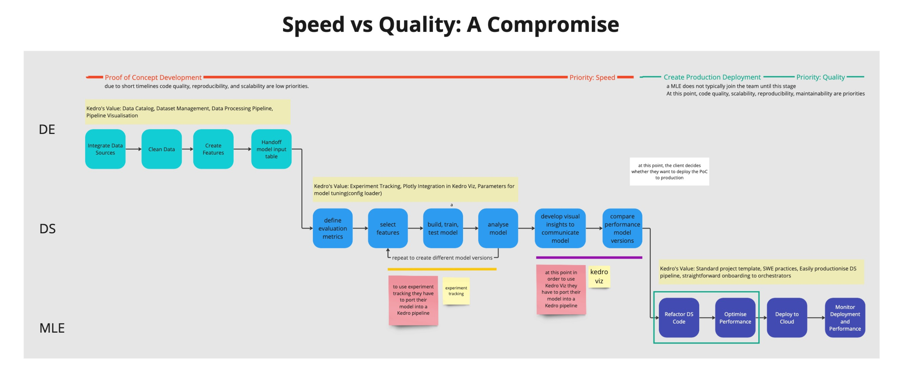
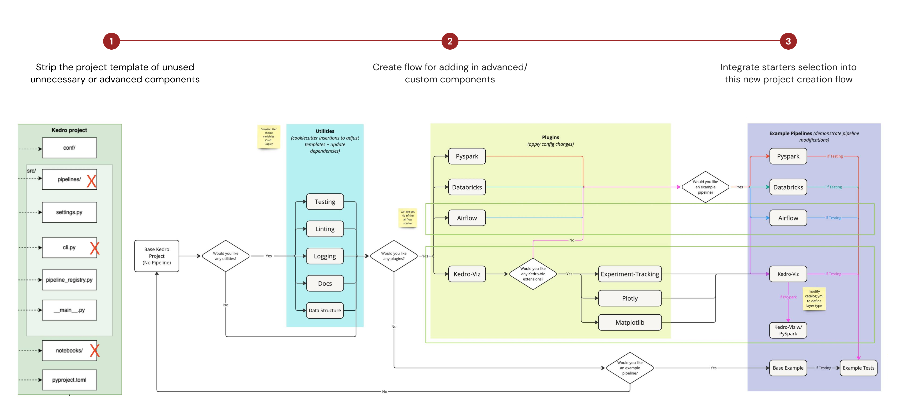
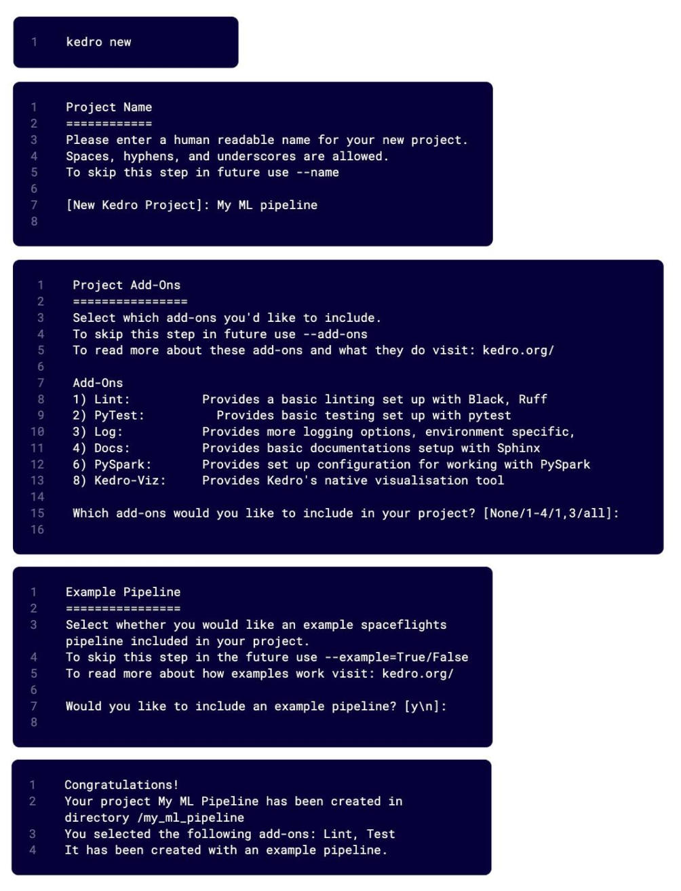

## My Role
I joined QuantumBlack as a <b>Technical UX Designer</b> to work on <a href="(https://kedro.org/)" style="white-space: nowrap">Kedro</a>, a python framework that helps users of any level get started with writing maintanable data science code. It was an internal tool developed by QB machine learning engineers to simplify their workflow across multiple client projects. 

### Role of Design

This was an experimental role, aiming to apply design methodologies to software development. The role of design within the team was ambiguous at first. I split it into 3 main areas: 

<b>User Research</b> To understand the needs and wants of the user base. Focusing on how to grow adoption internally and externally. 

<b>User Experience </b>User workflow mapping, identifying frictions and opportunity areas for feature development

<b>Interface Design</b> Targeted changes to the CLI to improve usability. Design of pipeline visualisation and experiment tracking UI. 

## The Problem 

Kedro had a steep learning curve. For Data Scientists (DS) and Data Engineers (DE) under time pressure, Kedro had a significant learning cost and high risk for few short term returns. However, for the Machine Learning Engineers (MLEs) responsible for productionising their code, Kedro was a huge time saver. As such, increasing Kedro adoption was important to our data science org in order to reduce MLE worklod given their relative scarcity.  

TLDR: My goal was to improve the Kedro user experience to drive adoption. 

## The Approach 

I tackled this problem with a two-pronged approach. There was no one magic pill that was going to improve adoption as there were a wide range of drop off points, each with different causes. 


<p align="center" style="font-size: 0.8em; ">The lifecycle of a data science project, highlighting the responsibilities of each role and the value of using Kedro at each stage</p>

<a href="#onboarding" style="white-space: nowrap">Approach 1: Improve Onboarding  </a>

- To tackle high user drop-off at project creation 
- To tackle fragmented onboarding journey across different user groups 

<a href="#documentation" style="white-space: nowrap">Approach 2: Improve Documentation  </a>

- To tackle drop-off during framework validation 


<a name="onboarding" style="display: block; position: relative; top: -9vw"></a>
## Improve Onboarding 
### Problem: Kedro had a fragmented onboarding journey 
Users arrived at Kedro in 2 main ways:

1. Incrementally introducing Kedro into their project
    - Using Kedro as a library inside a jupyter notebook
    - Converting a jupyter notebook into a Kedro project
2. Kedro from the start
    - Start from a blank project template 
    - Start from a starter project

The team already had multiple initiatives in place to try and make Kedro more flexible to being integrated into existing projects. After all, making it easy for people to convert to Kedro seemed key to driving adoption. However, in reality, the process was necessarily very manual, full of edge cases and created frankenstein Kedro projects that were hard to support long term. 

Taking a step back, I saw that using Kedro as a library rather than a framework was a popular intermediate step as it allowed people to pick and choose between kedro features without needing to use the full framework. In fact, this was the step in the conversion process where people often stopped. Looking at the needs of each of our user groups (DS, DE, MLEs) it was also clear that each group valued different features of Kedro. 

This was the heart of my proposal to make Kedro more flexible to multiple entry pathways by allowing users to customise a starting state according to their needs. A user trying to port a project would be guided to build a customised Kedro template that they could insert their old project code into. 

### Execution 


<p align="center" style="font-size: 0.8em; ">Outline of the proposed changes would fall in typical workflow of setting up a Kedro project</p>


The proposal was broken down into 3 parts 
1. Identify the unused, uncessary or advanced components of the project template and remove them from the base template 
2. Create a flow for adding in components modularly based on user input 
3. Standardise the structure of starter templates (a separate piece of work), so that starters could be added into the base template when requested 

This approach aimed to tackle drop off at project creation, as well as drop-off at framework validation as users would be able to get started for their specific use case more quickly, and therefore quickly identify whether Kedro suited their needs. 


### The Prototype: A Modular Kedro 

A write up for the release of this feature can be found on the [Kedro blog](https://kedro.org/blog/customise-a-new-kedro-project-with-tools) 

Overview: 

- using the ```kedro new``` CLI command would now bring up a creation wizard guiding users through the process of augmenting the base template to suit their needs. Flags could be applied to skip parts of the wizard. 

- the ```kedro new```command now has the optional flags
    - ```-name=<pipeline-name>```
    - ```--add-ons=lint,test,log,docs,pyspark,kedro-viz ```
    - ```--example=Y/N ```
    - ```--starter=spaceflights-pandas```


<p align="center" style="font-size: 0.8em; ">Each step of the new Kedro project creation wizard</p>


<a name="documentation" style="display: block; position: relative; top: -9vw"></a>
## Improve Documentation 

One of the key drop off points for Kedro adoption was users inability to quickly validate whether Kedro features would be useful to them. Even before users start trying to create a project, they were looking at the documentation. Therefore, it was a clear target if we wanted to reduce drop-off in the adoption funnel at the framework validation step.

We already knew our documentation had room for improvement based on ad-hoc feedback from our community and the number of support requests our engineers reported could have been resolved by more accessible documentation. However, we weren't sure where to start and what the exact issues were. 

### User Research

Our documentation collected user analytics via [Heap](https://www.heap.io/). I used this data to identify ares for improvement. 

I outline one example of the research to improvement journey. 

Insights: 

- Telemetry showed that interaction with the navigation bar was higher than interaction with in-built search 

- BUT the 60% of the time people were landing on non “home” pages suggesting that they were coming from google search or direct link. 

- Interviews showed that users found in-built search hard to use, using google search as a workaround 

### Actions

- Simplify sidebar to reduce scroll

- Improve search functionality  

- Adjusting landing pages and sitemap based on telemetry on site traffic

- Standardising language across documentation written by different people over a number of years

