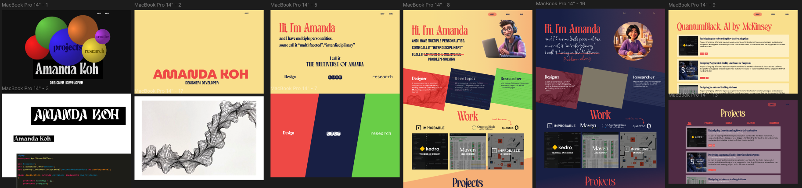

## The Context 

It's been 6 years since I last refreshed my portfolio. My [previous set up](/projects/portfolio) was pretty good, and I'd just add new markdown entries whenever I got a new job. But since I'd used a template for my last site, I'd always wanted to build a more customised website, so I could add a few more personal touches. But alas, I never did find the time. 

With vibe-coding gaining traction, the market was flooded with tools and I could barely keep up. I thought my portfolio website was a low stakes project to experiment with these tools, compare performance and learn how to effectively use them. 

## Initial Steps 

I started by making mockups in Figma so I could decide on the look and feel I was after. 

I couldn't decide between a cool, futuristic vibe, or a more warm and friendly aesthetic.

### One Shot Tests
Once I had fleshed out a mock up for the homepage, I decided to see how well different tools did trying to "one-shot" the designs. I gave both Lovable and Cursor (+ Figma MCP) the mock up and a short description, then set them loose. Unsurprisingly, the results were not great. In my previous experience, Lovable is good at taking some design liberties based on your brief, and can often surprise with good ideas you might not have though of. Cursor, is a better at following the brief more closely, but can struggle to maintain a clear design system as it builds out new components (even when I define the parameters at the start).

  

    <video autoplay loop muted playsinline style="width: 100%;">
      <source src="/content/projects/website/figmamockup.mp4" type="video/mp4" />
    </video>
    
Figma mockup

  

  

    <video autoplay loop muted playsinline style="width: 100%;">
      <source src="/content/projects/website/cursormockup.mp4" type="video/mp4" />
    </video>
    
Cursor output

  

  

    <video autoplay loop muted playsinline style="width: 100%;">
      <source src="/content/projects/website/lovablemockup.mp4" type="video/mp4" />
    </video>
    
Lovable output

  

## Building in Cursor 

I decided to build with Cursor using a more structured approach. I defined the set up I wanted it to use (React + Vite + Tailwind), then I broke down my prototype into separate components and built them individually. I displayed them in a makeshift component showcase to track my progress. There were Experience Cards, Project Cards and Role Cards. At this point I could also set up things like the fonts, colour palette, hover behaviour. 

<video autoplay loop muted playsinline style="width: 100%; max-width: 800px; display: block; margin: 0 auto;">
  <source src="/content/projects/website/componentshowcase.mp4" type="video/mp4" />
</video>

With these components built, I gave Cursor the homepage mock up again and asked it to build it with these components. This time the output was a lot better. It correctly matched the components to the ones in the mock up and laid out the page fairly accurately. Tweaks were still needed to fix responsiveness and the exact layout, but in 10 minutes, I was already 50% of the way there. 

## Testing out Claude Code 

Midway through the project, I got access to Claude Code. At this point, I had just managed to lay out the home page exactly as I liked. The next step was setting up the content management system. 

I explained what I wanted to Claude and asked it for a plan. My previous website fed markdown files into a defined project template so every project was displayed the same way and adding a new project just involved writing up the content in a new markdown file. It was a lightweight alternative to a full CMS that worked well for a personal website. 

What I liked about Claude was that it asked me a set of clarifying questions about what my goals for the site were before suggesting an approach. It then proposed 3 options, each with different advantages. One approach involved migrating the project to [Astro](https://astro.build/) for better static site generation capabilities. After checking that I'd be able to keep the React compnents I'd already built, it seemed like the best option. 

Claude handled the migration like a <i>wizard</i>. The home page was perfectly ported and it provided a basic template for project pages that already used the theme colours. I gave it access to the repo for my old website, and asked it to create a Projects gallery page. It copied over the projects and the page generation for each project just worked. 

After this, I was converted. the rest of the site was built in Claude Code. 

## AI Image Generation 

At this point, using AI to generate random images of yourself is hardly new. But, I wanted to have a cartoon version of me dressed in my different "roles" in the Hero section, and since my artistic talents weren't up to it, I hit up the image generation models. My previous forays into image generation had been quite hit and miss so this time I tried out a tip I'd seen online. I explained what I wanted to ChatGPT and asked it to write the prompts for me. Then I put these prompts into NanoBanana to generate the images. This definitely performed a lot better than me just freeforming into Gemini. By keeping the prompts for all 3 images the same format, it helped keep them relatively similar and NanoBanana did a really good job keeping the avatar "the same" across images. In previous attempts, every generation would be based on the reference image, but would clearly be different from each other. 

  
  
  

                                                                           

## Outcome

This website took me about 5 days to build (about 3 - 4 hrs per day), starting from the figma mockups, all the way through to fine-tuning the visuals and interactions. Writing up the new content was extra time on top of that.  

The process will certaintly be faster next time as I spent a lot of time experimenting, and I learned a lot about how to use the different tools more effectively. 

I'm very pleased with the final result. I had complete control over the look and feel of the site, and I feel like I was able to create something that represented my personality. It was fun to quickly experiment with different tweaks and see them in action. This was especially good for interactive interactions. 

In total, I used about $100 worth of tokens on Claude and $20 on Cursor. $120 for a new website might seem like a lot, but paying a monthly subscription for Figma Sites, Wix, or other no-code site generators can add up quickly over the long term. This upfront cost might just last me another 6 years, and I'll only pay for my domain name. 

## Takeaways

If I were doing this again, I'd likely start with Claude Code straight away. I want to see how it does one-shotting the design. Other things I'd like to try include: 
- starting with a clearer site map, rather than just the home page and expanding
- being stricter with the component building at the start, so things didn't end up hardcoded into the components 
- using Claude's plan feature more at the start to avoid migrations mid-project 